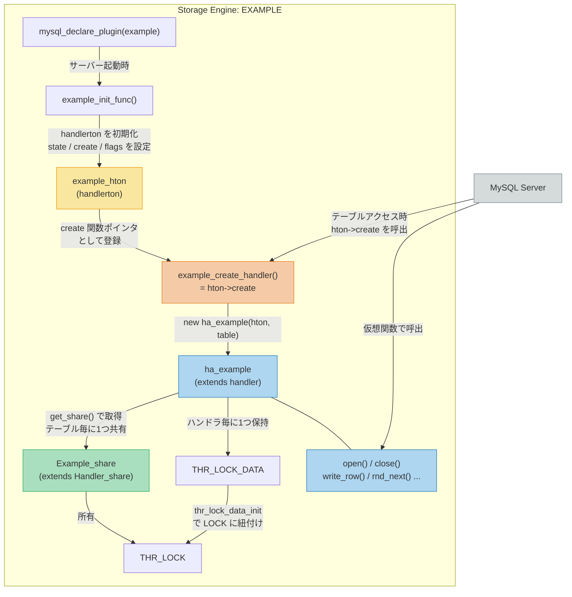

## アーキテクチャ

```mermaid
graph TD
    SQL["MySQL Server"]

    subgraph "Storage Engine: EXAMPLE"
        DECLARE["mysql_declare_plugin(example)"]
        INIT["example_init_func()"]
        HTON["example_hton<br/>(handlerton)"]
        CREATE_H["example_create_handler()<br/>= hton->create"]
        HA["ha_example<br/>(extends handler)"]
        SHARE["Example_share<br/>(extends Handler_share)"]
        LOCK["THR_LOCK"]
        LOCK_DATA["THR_LOCK_DATA"]

        METHODS["open() / close()<br/>write_row() / rnd_next() ..."]
    end

    DECLARE -->|"サーバー起動時"| INIT
    INIT -->|"handlerton を初期化<br/>state / create / flags を設定"| HTON
    HTON -->|"create 関数ポインタ<br/>として登録"| CREATE_H

    SQL -->|"テーブルアクセス時<br/>hton->create を呼出"| CREATE_H
    SQL -->|"仮想関数で呼出"| METHODS
    CREATE_H -->|"new ha_example(hton, table)"| HA

    HA -->|"get_share() で取得<br/>テーブル毎に1つ共有"| SHARE
    SHARE -->|"所有"| LOCK
    HA -->|"ハンドラ毎に1つ保持"| LOCK_DATA
    LOCK_DATA -->|"thr_lock_data_init<br/>で LOCK に紐付け"| LOCK

    HA --- METHODS

    style HTON fill:#f9e79f,stroke:#f39c12
    style HA fill:#aed6f1,stroke:#2980b9
    style SHARE fill:#a9dfbf,stroke:#27ae60
    style CREATE_H fill:#f5cba7,stroke:#e67e22
    style SQL fill:#d5dbdb,stroke:#808b96
    style METHODS fill:#aed6f1,stroke:#2980b9
```
